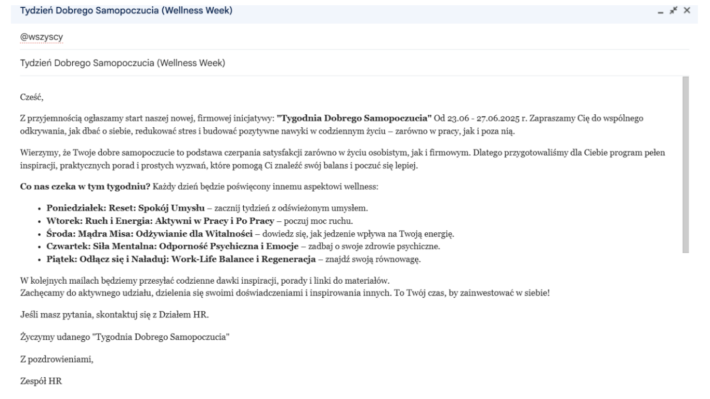
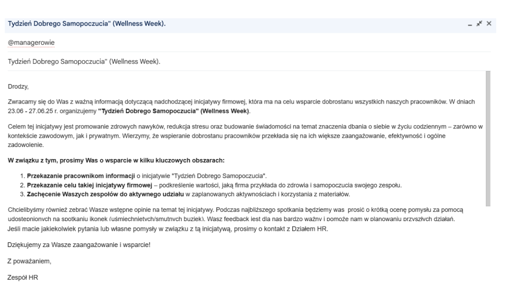

# Plan Komunikacji Wewnętrznej "Tydzień Dobrego Samopoczucia"

**Kategoria:** Komunikacja   
**Narzędzia:** Canva, Google Docs, Microsoft Excel, Google Forms

## Cel projektu

Zaplanowanie i stworzenie materiałów komunikacyjnych dla fikcyjnej inicjatywy firmowej "Tydzień Dobrego Samopoczucia" (Wellness Week).

## Moje działania

- Określenie grupy docelowej (wszyscy pracownicy) i kluczowych kanałów komunikacji(e-mail,plakaty)
- Napisanie treści maila do managerów
- Napisanie treści maila zapowiadającego wydarzenie do wszystkich pracowników
- Zaprojektowanie dwóch prostych, przyciągających wzrok plakatów w Canvie
- Przygotowanie harmonogramu komunikacji (kiedy i co publikujemy)
- Stworzenie ankiety oceny wyzwania firmowego

## Wiadomość do pracowników 

## Wiadomość do managerów

## Harmonogram komunikacyjny

<table>
<thead>
<tr>
<th>Data</th>
<th>Działanie</th>
<th>Plan Działania</th>
<th>Kanał komunikacyjny</th>
<th>Odbiorca</th>
<th>Ocena Działań przez odbiorcę</th>
</tr>
</thead>
<tbody>
<tr>
<td>16.06.25r.</td>
<td>Poinformowanie managerów o "Tygodniu dobrego samopoczucia"</td>
<td>1.Prośba o przekazanie przez managerów pracownikom informacji na temat inicjatywy firmowej 2.Prośba o przekazanie celu takiej inicjatywy firmowej 3. Pytanie czy Managerowie mają pytania lub pomysły w związku z inicjatywą firmową 4. Na spotkaniu podano wydrukowane minki w ramach oceny działań przez odbiorcę (uśmiechnięta/smutna) i każdy mógł ocenić przyszłą inicjatywę za pomocą minek</td>
<td>e-mail oraz spotkanie z managerami</td>
<td>Managerowie</td>
<td></td>
</tr>
<tr>
<td>18.06.25r.</td>
<td>Wysłanie E-mailu do pracowników firmy</td>
<td>1. Wysłanie wiadomości do pracowników firmy z informacją o inicjatywie firmowej mającej na celu poprawy samopoczucia oraz budowania świadomości</td>
<td>e-mail</td>
<td>Pracownicy</td>
<td></td>
</tr>
<tr>
<td>20.06.25r.</td>
<td>Wysłanie E-mailu z plakatem</td>
<td>1. Wysłanie wiadomośći z plakatem i zachęceniem do wzięciu udziału w tym wyzwaniu</td>
<td>e-mail</td>
<td>Pracownicy</td>
<td></td>
</tr>
<tr>
<td>23.06.25r.</td>
<td>Wysłanie E-mailu z 1 tematem: Reset, uważność i spokój umysłu</td>
<td>Wysłanie e-mailu z treścią dotyczącą 1 tematu</td>
<td>e-mail</td>
<td>Pracownicy</td>
<td></td>
</tr>
<tr>
<td>24.06.25r.</td>
<td>Wysłanie E-mailu z 2 tematem: Ruch i Energia: Aktywni w pracy i po pracy</td>
<td>Wysłanie e-mailu z treścią dotyczącą 2 tematu</td>
<td>e-mail</td>
<td>Pracownicy</td>
<td></td>
</tr>
<tr>
<td>25.06.25r.</td>
<td>Wysłanie E-mailu z 3 tematem: Mądra Misa: Odżywianie dla witalności</td>
<td>Wysłanie e-mailu z treścią dotyczącą 3 tematu</td>
<td>e-mail</td>
<td>Pracownicy</td>
<td></td>
</tr>
<tr>
<td>26.06.25r.</td>
<td>Wysłanie E-mailu z 4 tematem: Siła umysłu: Odporność psychiczna i emocje</td>
<td>Wysłanie e-mailu z treścią dotyczącą 4 tematu</td>
<td>e-mail</td>
<td>Pracownicy</td>
<td></td>
</tr>
<tr>
<td>27.06.25r.</td>
<td>Wysłanie E-mailu z 5 tematem: Odłącz się i Naładuj: Work life balance i Regeneracja</td>
<td>Wysłanie e-mailu z treścią dotyczącą 5 tematu</td>
<td>e-mail</td>
<td>Pracownicy</td>
<td></td>
</tr>
</tbody>
</table>

## Plakaty

## Wyniki

- Gotowe do użycia szablony komunikacyjne
- Check lista Onboardingowa: Pierwszy Dzień     
- Materiały wizualne (plakaty) w 2 wersjach
- Ankieta oceniająca "Tydzień obrego Samopoczucia"
- Harmonogram publikacji z dokładnymi terminami
