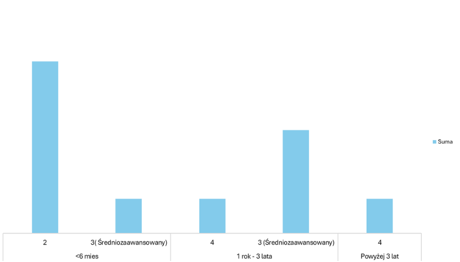
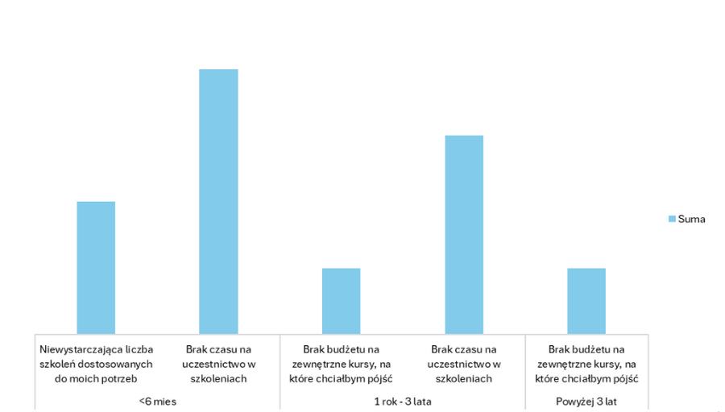
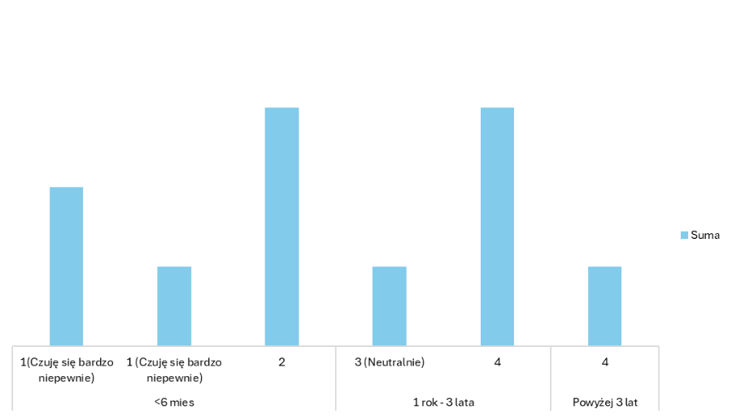
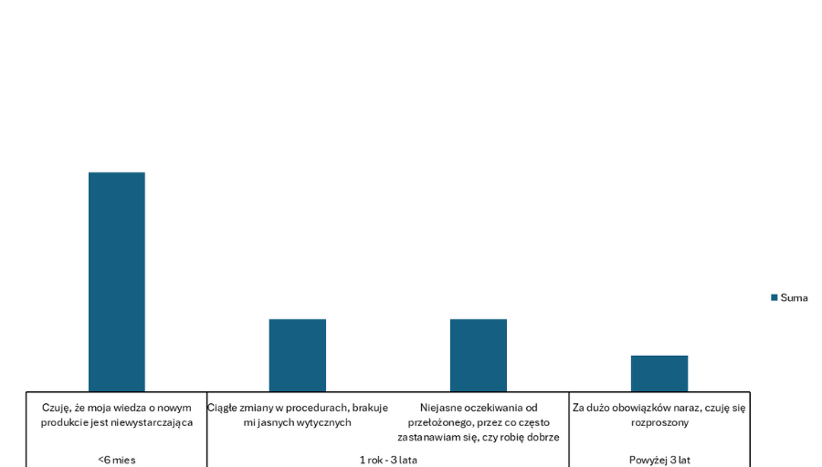

# Analiza Potrzeb Rozwojowych Zespołu

**Kategoria:** Analiza danych  
**Narzędzia:** Microsoft Excel, Google Forms, Google Sheets

## Cel projektu

Identyfikacja kluczowych potrzeb rozwojowych w 11-osobowym zespole poprzez przeprowadzenie ankiety. Zebrane dane posłużyły do analizy obecnego stanu kompetencji, barier rozwojowych oraz ogólnego samopoczucia w pracy.

## Metodologia

Przeprowadzono anonimową ankietę online za pośrednictwem Google Forms, skierowaną do 11 fikcyjnych członków zespołu. Ankieta zawierała 7 pytań otwartych i zamkniętych. Dane zostały zebrane w Google Sheets, a analiza wraz z  wizualizacją wykonano w Microsoft Excel.

---
---

  
## Stopień zaawansowania w stosunku do stażu pracy

**Wykres przedstawia poziom znajomości programu MS Excel deklarowany przez respondentów, z podziałem na długość ich stażu pracy. Ocena znajomości wspomnianego programu była od 1 do 5, gdzie 1 to podstawowy a 5 to Eksperci. Zauważalna jest dominacja ocen 2 i 3 (podstawowy/średniozaawansowany) w grupie nowo zatrudnionych (<6 mies.) oraz tych z 1-3 letnim stażem.**

---
---

## Największe przeszkody w rozwijaniu kompetencji zawodowych  w stosunku do stażu pracy

**Wykres ilustruje główne bariery, które pracownicy napotykają w swoim rozwoju zawodowym.**  

**W każdej grupie stażowej, "Brak czasu na uczestnictwo w szkoleniach" jest kluczową przeszkodą.**

---
---

## Poczucie komfortu i pewności w wykonywaniu codziennych zadań w pracy

**Wykres prezentuje ogólne samopoczucie i poczucie pewności w wykonywaniu codziennych obowiązków. Wyniki wskazują na niższe poczucie komfortu u pracowników z krótszym stażem (<6 mies.) w porównaniu do tych z dłuższym doświadczeniem.**

---
---

## Co wpływa na negatywne samopoczucie w pracy

**Wykres przedstawia czynniki mające wpływ na samopoczucie w pracy.**

**Wśród pracowników z stażem mniejszym niż 6 miesięcy dominuje problem niewystarczającej wiedzy produktowej, natomiast u pozostałych pojawiają się kwestie związane z jasnością procedur oczekiwań kierownika oraz zbyt dużą ilością obowiązków.**

## Główne wnioski

1.Potrzeba wzmocnienia wiedzy produktowej i podstaw Excela u nowych pracowników: Znaczna grupa pracowników z krótkim stażem (<6 miesięcy) wskazuje na niewystarczającą wiedzę produktową (6 osób) oraz niskie/średnie kompetencje w Excelu
(5 osób ocena 2, 1 osoba ocena 3), co bezpośrednio wpływa na ich poczucie niepewności w pracy.

2.Brak czasu jako główna bariera rozwojowa: Niezależnie od stażu, "Brak czasu na uczestnictwo w szkoleniach" (łącznie 7 osób) jest najczęściej wskazywaną przeszkodą w rozwoju kompetencji. Sugeruje to potrzebę organizowania efektywnych form szkoleń

3.Wyzwania związane z jasnością procesów i oczekiwań dla doświadczonych pracowników: Osoby ze stażem powyżej 1 roku wskazują na problemy z ciągłymi zmianami w procedurach (2 osoby) oraz niejasnymi oczekiwaniami od przełożonego (2 osoby), co wpływa na ich samopoczucie i efektywność.

## Rekomendacje

### Wzmocnienie procesu onboardingu i szkoleń wstępnych:

Działanie: Opracowanie  modułu szkoleniowego z zakresu wiedzy produktowej (np. 1-2 dniowe warsztaty) oraz wprowadzenie obowiązkowego, praktycznego szkolenia z podstaw MS Excel, dla osób deklarujących niski/średni poziom oraz dla nowo zatrudnionych pracowników w ciągu pierwszych 3 miesięcy pracy.

Cel: Zwiększenie poczucia pewności i komfortu u nowych członków zespołu zapewniając im solidną podstawę do wykonywania obowiązków oraz ułatwienie pracy z Excelem u osób z większym stażem pracy.

### Wdrożenie  mikro-szkoleń:

Działanie: Z uwagi na deklarowany brak czasu na uczestnictwo w szkoleniach, warto wprowadzić krótkie, modułowe szkolenia np. 30-60 minutowe webinary, pigułki wiedzy w formie e-learningu, krótkie warsztaty dostępne na żądanie. Szczególnie uwzględniając najczęściej wskazywane obszary (np. zarządzanie czasem, komunikacja (Wynika to z odpowiedzi otwartych).

Cel: Umożliwienie pracownikom rozwoju kompetencji bez nadmiernego obciążania ich czasu pracy.

### Optymalizacja komunikacji wewnętrznej i klarowności oczekiwań:

Działanie: Przeprowadzenie warsztatów dla menedżerów w celu doskonalenia umiejętności precyzowania oczekiwań i delegowania zadań. Wdrożenie regularnych wewnętrznych newsletterów informujących o zmianach w procedurach i ich wpływie na codzienne obowiązki.

Cel: Zwiększenie jasności ról, zadań i procesów, co przyczyni się do poprawy samopoczucia i efektywności całej organizacji, szczególnie wśród bardziej doświadczonych pracowników.
