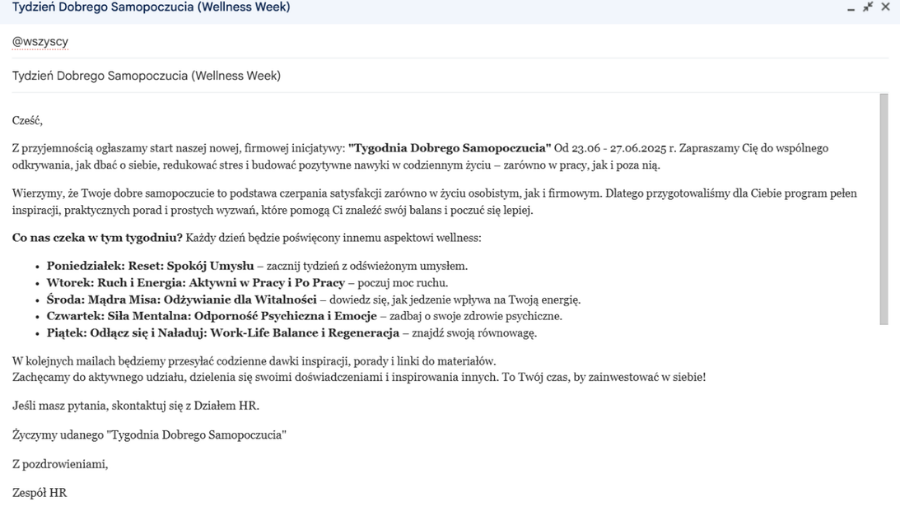
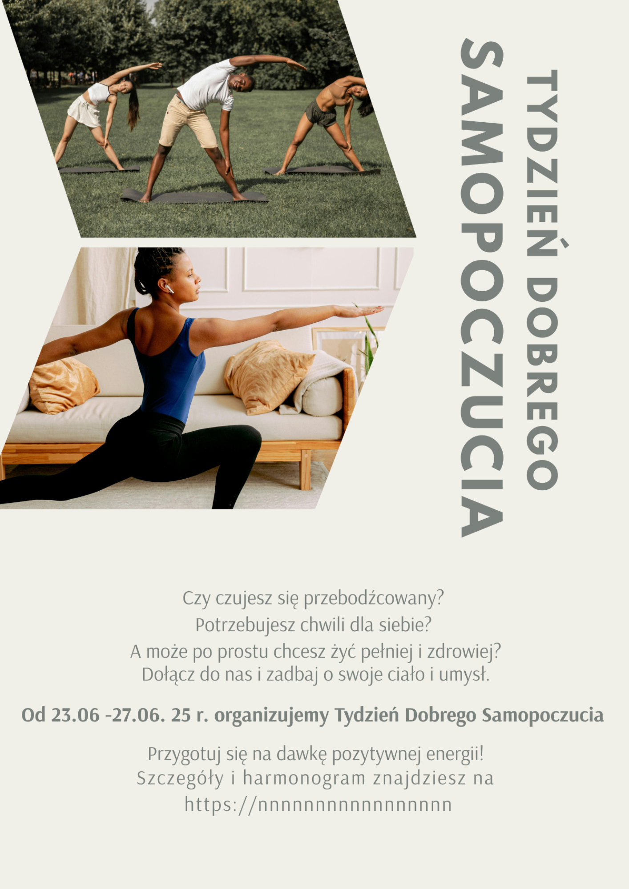

# Plan Komunikacji Wewnętrznej "Tydzień Dobrego Samopoczucia"

**Kategoria:** Komunikacja   
**Narzędzia:** Canva, Google Docs, Microsoft Excel, Google Forms

## Cel projektu

Zaplanowanie i stworzenie materiałów komunikacyjnych dla fikcyjnej inicjatywy firmowej "Tydzień Dobrego Samopoczucia" (Wellness Week).

## Moje działania

- Określenie grupy docelowej (wszyscy pracownicy) i kluczowych kanałów komunikacji
- Napisanie treści maila do managerów
- Napisanie treści maila zapowiadającego wydarzenie
- Zaprojektowanie prostego, przyciągającego wzrok plakatu w Canvie
- Przygotowanie harmonogramu komunikacji (kiedy i co publikujemy)
- Stworzenie ankiety oceny wyzwania firmowego

## Wiadomości do Managerów oraz pracowników 

## Harmonogram komunikacyjny

| Data | Działanie | Plan Działania | Kanał komunikacyjny | Odbiorca | Ocena Działań przez odbiorcę |
| --- | --- | --- | --- | --- | --- |
| 16.06.25r. | Poinformowanie managerów o "Tygodniu dobrego samopoczucia" | 1.Prośba o przekazanie przez managerów pracownikom informacji na temat inicjatywy firmowej 2.Prośba o przekazanie celu takiej inicjatywy firmowej 3. Pytanie czy Managerowie mają pytania lub pomysły w związku z inicjatywą firmową 4. Na spotkaniu podano wydrukowane minki w ramach oceny działań przez odbiorcę (uśmiechnięta/smutna) i każdy mógł ocenić przyszłą inicjatywę za pomocą minek | e-mail oraz spotkanie z managerami | Managerowie |  |
| 18.06.25 r. | Wysłanie E-mailu do pracowników firmy | 1. Wysłanie wiadomości do pracowników firmy z informacją o inicjatywie firmowej mającej na celu poprawy samopoczucia oraz budowania świadomości | e-mail | Pracownicy |  |
| 20.06. 25r. | Wysłanie E-mailu z plakatem | 1. Wysłanie wiadomośći z plakatem i zachęceniem do wzięciu udziału w tym wyzwaniu | e-mail | Pracownicy |  |
| 23.06.25 r. | Wysłanie E-mailu z 1 tematem: Reset, uważność i spokój umysłu | Wysłanie e-mailu z treścią dotyczącą 1 tematu | e-mail | Pracownicy |  |
| 24.06.25 r. | Wysłanie E-mailu z 2 tematem: Ruch i Energia: Aktywni w pracy i po pracy | Wysłanie e-mailu z treścią dotyczącą 2 tematu | e-mail | Pracownicy |  |
| 25.06.25 r. | Wysłanie E-mailu z 3 tematem: Mądra Misa: Odżywianie dla witalności | Wysłanie e-mailu z treścią dotyczącą 3 tematu | e-mail | Pracownicy |  |
| 26.06.25 r. | Wysłanie E-mailu z 4 tematem: Siła umysłu: Odporność psychiczna i emocje | Wysłanie e-mailu z treścią dotyczącą 4 tematu | e-mail | Pracownicy |  |
| 27.06.25 r | Wysłanie E-mailu z 5 tematem: Odłącz się i Naładuj: Work life balance i Regeneracja | Wysłanie e-mailu z treścią dotyczącą 5 tematu | e-mail | Pracownicy |  |

## Plakaty

## Wyniki

- Gotowe do użycia szablony komunikacyjne
- Kompleksowy plan komunikacji na 5 dni
- Materiały wizualne (plakaty) w 2 wersjach
- Ankieta ewaluacyjna z 8 pytaniami
- Harmonogram publikacji z dokładnymi terminami