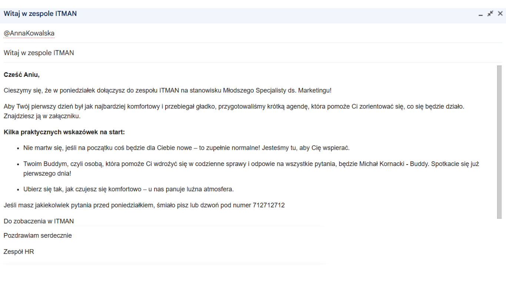
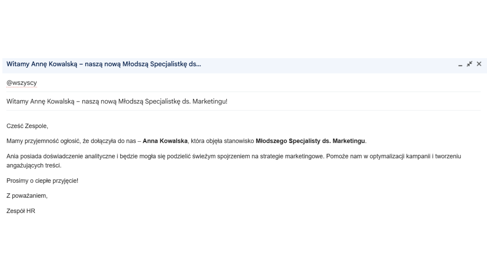

# Program Onboardingowy "Start"

**Kategoria:** Onboarding   
**Narzędzia:** Canva, Microsoft Word

## Cel projektu

Zaprojektowanie 1 - dniowego planu wdrożenia dla nowego pracownika na stanowisku 
"Młodszy Specjalista ds. Marketingu", aby skrócić czas adaptacji i zwiększyć jego zaangażowanie od pierwszego dnia oraz zaprojektowanie Checklistę Onboardingową: Pierwszy Dzień dla managera oraz buddy

## Moje działania

- Przeprowadzenie research dotyczącego najlepszych praktyk onboardingowych
- Stworzenie szczegółowej checklisty zadań na pierwszy dzień dla managera oraz buddy
- Opracowanie pomysłu na "Welcome Pack" (pakiet powitalny)
- Przygotowanie szablonów komunikacyjnych ( powitalne)
- Stworzenie checklisty dla nowego pracownika

## Wiadomość do nowego pracownika  

## Wiadomość do pracowników

---
---

## Checklista Onboardingowa
    
**Stanowisko:** Młodszy Specjalista ds. Marketingu  
**Osoba wprowadzająca:** Manager Antoni Kowalski  
**Buddy:** Michał Kornacki

### Dzień 1 - Powitanie i Integracja

<table>
  <thead>
    <tr>
      <th>Zadanie</th>
      <th>Odpowiedzialny</th>
      <th></th>
    </tr>
  </thead>
  <tbody>
    <tr>
      <td>1. Przygotowanie stanowiska pracy (sprzęt, materiały biurowe)</td>
      <td>Menedżer/HR</td>
      <td><input type="checkbox"></td>
    </tr>
    <tr>
      <td>2. Sprawdzenie dostępności podstawowego oprogramowania (MS Office, przeglądarka, komunikator oraz stanowiska pracy)</td>
      <td>Menedżer</td>
      <td><input type="checkbox"></td>
    </tr>
    <tr>
      <td>3. Przekazanie - Welcome Pack (Torba płócienna z kubkiem, listem powitalnym z logo firmy i sezonowymi owocami)</td>
      <td>HR</td>
      <td><input type="checkbox"></td>
    </tr>
    <tr>
      <td>4. Powitanie nowego pracownika, przedstawienie jego o godzinie 10:00</td>
      <td>Menedżer</td>
      <td><input type="checkbox"></td>
    </tr>
    <tr>
      <td>5. Oprowadzenie po biurze, wskazanie gdzie jest toaleta, wyjście ewakuacyjne, kuchnia oraz jak korzysta się z ekspresu</td>
      <td>Menedżer</td>
      <td><input type="checkbox"></td>
    </tr>
    <tr>
      <td>6. Przeprowadzenie wstępnej rozmowy o roli, oczekiwaniach i celu zespołu. Przekazanie ważnych informacji o życiu firmy i panujących w niej zwyczajach.</td>
      <td>Menedżer</td>
      <td><input type="checkbox"></td>
    </tr>
    <tr>
      <td>7. Zapoznanie z Buddy o godzinie 12:00</td>
      <td>Menedżer</td>
      <td><input type="checkbox"></td>
    </tr>
    <tr>
      <td>8. Udział w lunchu integracyjnym z zespołem.</td>
      <td>Buddy</td>
      <td><input type="checkbox"></td>
    </tr>
  </tbody>
</table>

---
---

## Checklista Onboardingowa dla nowego pracownika: Pierwszy Dzień

Cześć, cieszę się że dołączyłeś/aś do naszego zespołu. Poniżej załączam kilka Tick off, które polecam zrealizować. 

<table>
  <thead>
    <tr>
      <th colspan="2">Checklista</th>
    </tr>
  </thead>
  <tbody>
    <tr>
      <td>1. Zapoznaj się z podstawowymi narzędziami pracy (laptop, telefon służbowy).</td>
      <td><input type="checkbox"></td>
    </tr>
    <tr>
      <td>2. Zainstaluj komunikator.</td>
      <td><input type="checkbox"></td>
    </tr>
    <tr>
      <td>3. Poznaj Buddiego oraz członków zespołu.</td>
      <td><input type="checkbox"></td>
    </tr>
    <tr>
      <td>4. Zwiedź biura, a szczególnie: toaleta, wyjścia ewakuacyjne oraz kuchnię, gdzie musisz zasmakować naszej kawy.</td>
      <td><input type="checkbox"></td>
    </tr>
    <tr>
      <td>5. Dowiedz się o oczekiwaniach i celu zespołu.</td>
      <td><input type="checkbox"></td>
    </tr>
    <tr>
      <td>6. Weź udział w lunchu integracyjnym.</td>
      <td><input type="checkbox"></td>
    </tr>
  </tbody>
</table>